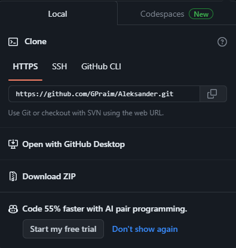
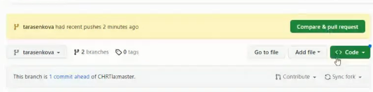

# Это файл для дз. Жду ваши изменения снизу, в последующих строках в этом файле)

# Инструкция по работе в Git

## Что такое Git?

Git стал мировым стандартом для управления версиями. Так что именно это?

Git — это распределенная система управления версиями, которая означает, что локальный клон проекта — это полный репозиторий управления версиями. Полнофункциональные локальные репозитории упрощают работу как в автономном, так и в удаленном режиме. Разработчики фиксируют свою работу локально, а затем синхронизируют копию репозитория с копией на сервере. Эта парадигма отличается от централизованных систем управления версиями, где клиенты должны синхронизировать код с сервером перед созданием новой версии кода.

Гибкость и популярность Git делают его отличным выбором для любой команды. Многие разработчики и выпускники колледжа уже знают, как использовать Git. Сообщество пользователей Git создало ресурсы для обучения разработчиков и популярности Git, что упрощает получение помощи при необходимости. Почти каждая среда разработки поддерживает Git и средства командной строки Git, реализованные в каждой основной операционной системе.

## Подготовка репозитория

Для создания репозитория необходимо ввести комманду git init. Создастся скрытая папка .git

## Создание commit-ов

### Git add
Для добавления измений в коммит используется команда git add. Чтобы использовать команду git add напишите git add <имя файла>

### Просмотр состояния репозитория
Для того, чтобы посмотреть состояние репозитория используется команда git status. Для этого необходимо в папке с репозиторием написать git status, и Вы увидите были ли измения в файлах, или их не было.

### Создание коммитов
Для того, чтобы создать коммит(сохранение) необходимо выполнить команду git commit. Выполняется она так: git commit -m "<сообщение к коммиту>. Все файлы для коммита должны быть ДОБАВЛЕНЫ и сообщение к коммиту писать ОБЯЗАТЕЛЬНО.

### Перемещение между сохранениями
Для того, чтобы перемещаться между коммитами, используется команда git checkout. Используется она в папке с пепозиторием следующим образом: git checkout <номер коммита>

# Ветки в Git
## Создание веток
*git branch branchname - создать новую ветку для git*
## Слияние веток
*git merge branchname - слить две ветки в одну*
## Конфликты веток
*Конфликты возникают когда затронуто общее рабочее пространство.*

# Удаленный доступ
## Для чего нужен удаленный доступ?
*Это удобная возможность работать с нашим репозиторием, который расположен в сети интернет на GitHub.*
## Чтобы подключиться к удаленному репозиторию:
*Необходимо ввести команду git remote add origin [ссылка]*
## Как загрузить в удаленный репозиторий изменения 
*Необходимо ввести комманду git push -u origin [название ветки]*

## Как предложить изменения в созданный репозиторий кем-то.
*Для начала сделайте Fork репозитория*

*Затем клонируйте свой Fork к себе на ПК коммандой git clone [ссылка] (Удостоверьтесь что клонируете именно свой Форк)*

*После того как вы сделаете коммит, вам необходимо отправить Pull Request*

